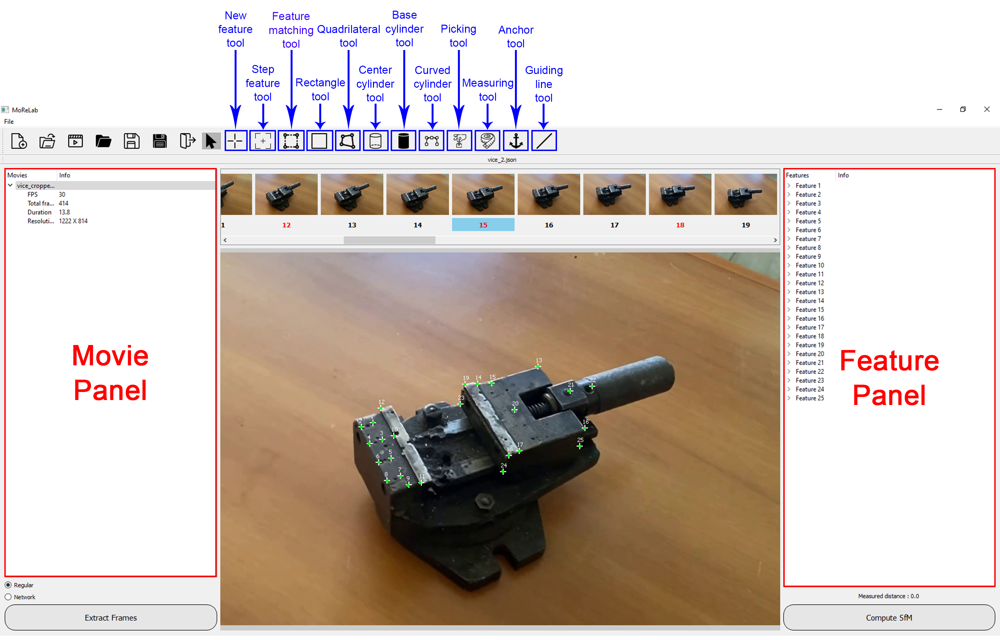

# MoReLab: A software for user-assisted 3D reconstruction

MoRelab is an open-source software that allows the user to import a video, extract frames, specify feature correspondences in those frames, and estimate camera parameters and the 3D points corresponding to marked features simultaneously. Then, the user can calibrate and perform measurements. In addition, the user can make use of primitive tools to model surfaces such as complex and curved pipes. This is extremely important to model industrial equipment, which is the main target in our research, and to measure them. MoReLab also enables users to model shapes that are typical of industrial equipment (e.g., cylinders, curved cylinders, etc.) and measure them.



## Tutorial
Please watch [MoReLab tutorial](https://youtu.be/UA_6RRJ2YoY) on YouTube to familiarize yourself with the usage of MoReLab and it's tools

## Papers
Details related to MoReLab have been provided in two research papers. The [first paper](https://www.mdpi.com/1424-8220/23/14/6456) introduces MoReLab and it's tools. The [second paper](https://ieeexplore.ieee.org/abstract/document/10613405) talks about a user study conducted to evaluate MoReLab against other user-assisted tools.

## Installation instructions
This software has been developed in Python 3.8 and PyQt5. The software also requires you to install PyQt with CUDA support. The software has been tested on Windows and Ubuntu. But it has not been tested on Mac.

### Instructions for Windows and Linux
- Open Anaconda Powershell prompt and create a Python 3.8 environment by entering the command:
~~~
conda create --name morelab_env python=3.8
~~~

- Activate the environment by entering the command
~~~
conda activate morelab_env
~~~

- Clone this repository using the command:
~~~
git clone https://github.com/cnr-isti-vclab/MoReLab.git
~~~

- Also clone the SuperGlue repository using this command:
~~~
git clone https://github.com/magicleap/SuperGluePretrainedNetwork.git
~~~

- Copy the folder of models from SuperGlue repository to . You can do it manually or use this command:
~~~
cp -r SuperGluePretrainedNetwork/models MoReLab/
~~~

-At this point MoReLab directory should look like this:
```bash
├── models
│   ├── weights/
│   ├── matching.py
│   ├── superglue.py
│   ├── superpoint.py
│   └── utils.py
├── icons/
├── readme_images/
├── sample_movies/
├── util/
├── main.py
├── central_widget.py
├── GL_widget_viewer.py
├── user_interface.py
├── rectangle.py
├── quad.py
├── rectangle.py
├── constraints.py
├── curve.py
├── cylinder.py
├── feature_panel.py
├── features.py
├── movie_panel.py
├── util_viewer.py
├── requirements.txt
└── .gitignore
```

- Move to the repository:
~~~
cd MoReLab
~~~

- Install all python libraries using the following command:
~~~
pip install -r requirements.txt
~~~

- Install pytorch 1.12.1 with cuda 13. This can be done by using the following conda command:
~~~
conda install pytorch==1.12.1 torchvision==0.13.1 torchaudio==0.12.1 cudatoolkit=11.3 -c pytorch
~~~
Please refer to [PyTorch website](https://pytorch.org/get-started/previous-versions/) for more information.


- Finally run the main file to run software using the following command:
~~~
python main.py
~~~

## Cite our work
If you use this software or code, feel free to cite the following research works:

~~~
@Article{siddique2023morelab,
AUTHOR = {Siddique, Arslan and Banterle, Francesco and Corsini, Massimiliano and Cignoni, Paolo and Sommerville, Daniel and Joffe, Chris},
TITLE = {MoReLab: A Software for User-Assisted 3D Reconstruction},
JOURNAL = {Sensors},
VOLUME = {23},
YEAR = {2023},
NUMBER = {14},
ARTICLE-NUMBER = {6456},
URL = {https://www.mdpi.com/1424-8220/23/14/6456},
PubMedID = {37514750},
ISSN = {1424-8220},
DOI = {10.3390/s23146456}
}

@ARTICLE{siddique2024access,
  author={Siddique, Arslan and Cignoni, Paolo and Corsini, Massimiliano and Banterle, Francesco},
  journal={IEEE Access}, 
  title={Evaluating Image-Based Interactive 3D Modeling Tools}, 
  year={2024},
  volume={12},
  number={},
  pages={104138-104152},
  keywords={Three-dimensional displays;Solid modeling;Surface reconstruction;Image reconstruction;Computational modeling;Cameras;Task analysis;User-assisted 3D reconstruction;interactive 3D modeling;computer graphics;image based-3D reconstruction;structure-from-motion},
  doi={10.1109/ACCESS.2024.3434584}}
~~~
